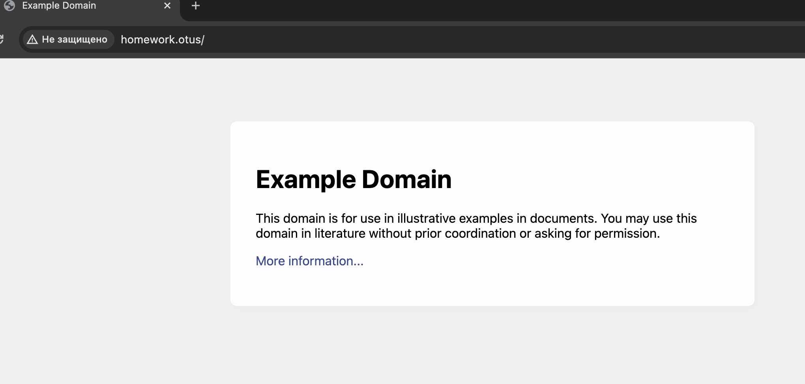
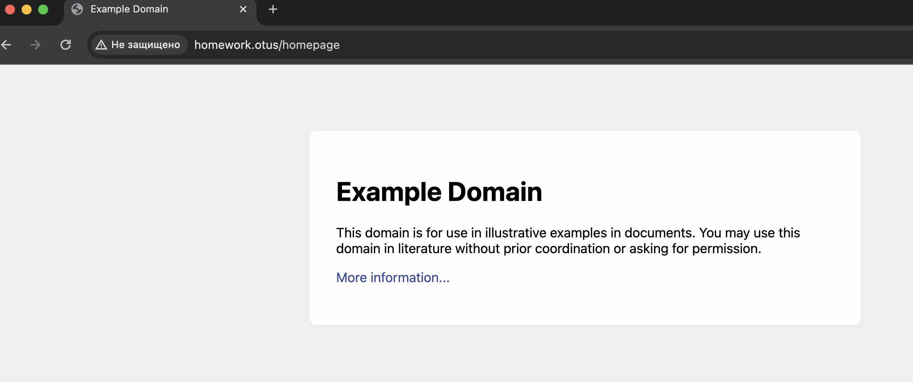

# Создаем новую ветку kubernetes-controllers и переходим в нее
git checkout -b kubernetes-networks

# Создаем новую папку kubernetes-controllers
mkdir kubernetes-networks && cd kubernetes-networks

# Создаем манифест namespace.yaml и копируем в него данные из предыдущего ДЗ
touch namespace.yaml

# Применяем манифест namespace.yaml
kubectl apply -f namespace.yaml
namespace/homework created

# Проверяем что namespace создался
nickolayfilippov@MacBook kubernetes-networks % kubectl get ns                 
NAME              STATUS   AGE
default           Active   76d
homework          Active   3s
ingress-nginx     Active   8d
kube-node-lease   Active   76d
kube-public       Active   76d
kube-system       Active   76d

# Создаем манифест deployment.yaml
touch deployment.yaml

# Копируем манифест из предыдущего ДЗ и изменяем readinessProbe

        readinessProbe:
          httpGet:
            path: /index.html
            port: 80

# Применяем манифест deployment.yaml
kubectl apply -f deployment.yaml
deployment.apps/controllers-pod created

# Проверяем что создалось 3 пода и они в статусе running
nickolayfilippov@MacBook kubernetes-networks % kubectl get po -n homework                
NAME                               READY   STATUS    RESTARTS   AGE
controllers-pod-7fd88f9947-629bp   1/1     Running   0          24s
controllers-pod-7fd88f9947-88kpp   1/1     Running   0          26s
controllers-pod-7fd88f9947-qlrqz   1/1     Running   0          26s

# Создаем манифест service.yaml
touch service.yaml

# Настраиваем service.yaml согласно ДЗ и прикручиваем на порт 8000

elector:
    app: webapp
  ports:
    - protocol: TCP
      port: 8000
      targetPort: 80
  type: ClusterIP

# Применяем манифест service.yaml
nickolayfilippov@MacBook kubernetes-networks % kubectl apply -f service.yaml
service/webapp-service created

# Проверяем что сервис поднялся и слушает на нужном порту
nickolayfilippov@MacBook kubernetes-networks % kubectl get svc -n homework  
NAME             TYPE        CLUSTER-IP       EXTERNAL-IP   PORT(S)    AGE
webapp-service   ClusterIP   10.103.163.124   <none>        8000/TCP   2m2s

# Создаем манифест ingress.yaml
touch ingress.yaml

# Настраиваем ingress.yaml согласно ДЗ
      - path: /
        pathType: Prefix
        backend:
          service:
            name: webapp-service
            port:
              number: 8000

# Применяем манифест ingress.yaml
nickolayfilippov@MacBook kubernetes-networks % kubectl apply -f ingress.yaml
ingress.networking.k8s.io/webapp-ingress created

# Проверяем что ingress поднялся и идет на необходимый сервис
nickolayfilippov@MacBook kubernetes-networks % kubectl get ingress -n homework
NAME             CLASS   HOSTS           ADDRESS        PORTS   AGE
webapp-ingress   nginx   homework.otus   192.168.49.2   80      80s

# Включаем minikube туннель
nickolayfilippov@MacBook emepic_repo % minikube tunnel
✅  Tunnel successfully started

# Проверяем доступность страницы http://homework.otus из браузера

# Доработать манифест ingress.yaml описав в нем rewrite-правила так, чтобы обращение по адресу http://homework.otus/homepage форвардилось на http://homework.otus/index.html

- path: /homepage
        pathType: Exact
        backend:
          service:
            name: webapp-service
            port:
              number: 8000

# Проверяем работу перенаправления в браузере

