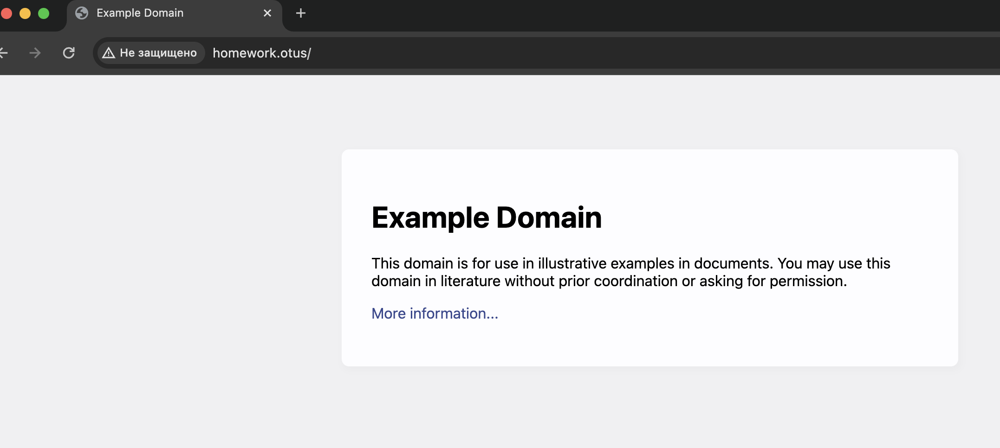
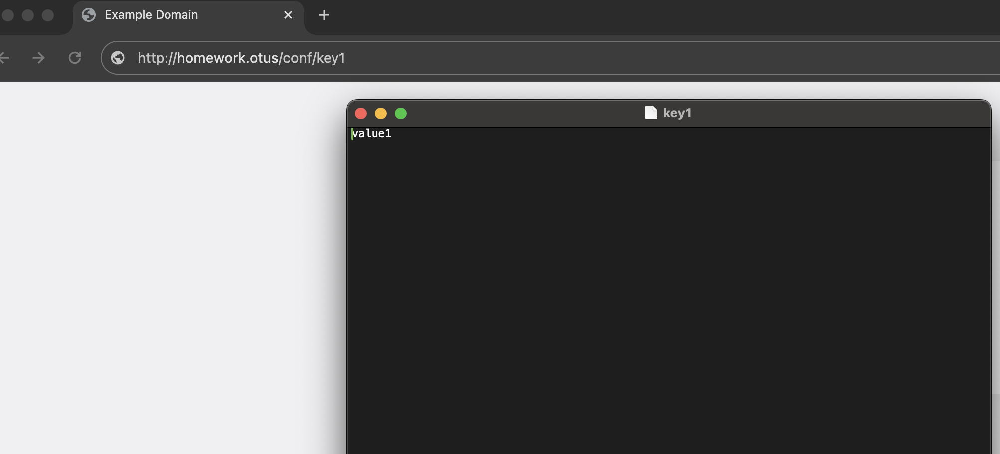
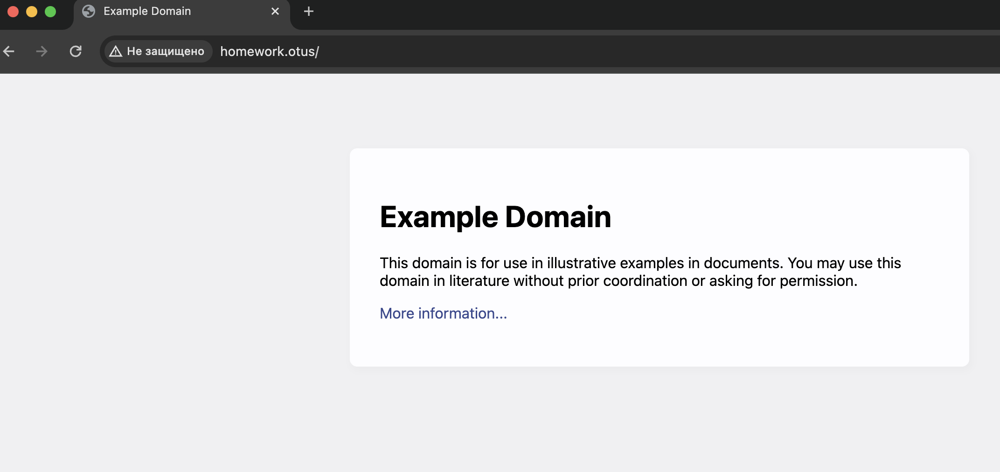
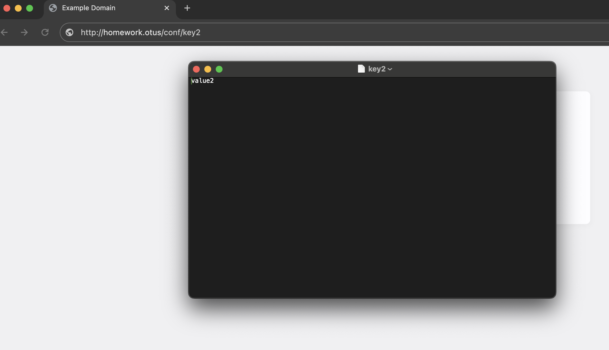

# Создаем новую ветку kubernetes-controllers и переходим в нее
git checkout -b kubernetes-volumes

# Создаем новую папку kubernetes-controllers
mkdir kubernetes-volumes && cd kubernetes-volumes

# Создаем манифест namespace.yaml и копируем в него данные из предыдущего ДЗ
touch namespace.yaml

# Применяем манифест namespace.yaml
kubectl apply -f namespace.yaml
namespace/homework created

# Проверяем что namespace создался
nickolayfilippov@MacBook kubernetes-volumes % kubectl get ns
NAME              STATUS   AGE
default           Active   90d
homework          Active   17s
ingress-nginx     Active   22d
kube-node-lease   Active   90d
kube-public       Active   90d
kube-system       Active   90d

# Создаем манифест pvc.yaml запрашиваюий хранилище с storageClass по-умолчанию
spec:
  accessModes:
  - ReadWriteOnce
  resources:
    requests:
      storage: 1Gidep   

# Применяем манифест pvc.yaml
kubectl apply -f pvc.yaml
persistentvolumeclaim/pvchw4 created

# Проверяем что pvc создался
nickolayfilippov@MacBook kubernetes-volumes % kubectl get pvc -n homework
NAME     STATUS   VOLUME                                     CAPACITY   ACCESS MODES   STORAGECLASS   AGE
pvchw4   Bound    pvc-e55a3097-d2bc-47ec-b00e-84ff72324c5c   1Gi        RWO            standard       5s

# Создаем манифест cm.yaml для объекта типа configMap, описываюий произвольный набор пар ключ-значение
data:
 key1: value1
 key2: value2
 key3: value3

# Применяем манифест cm.yaml
nickolayfilippov@MacBook kubernetes-volumes % kubectl apply -f cm.yaml        
configmap/cmhw4 created

# Проверяем что cm создался
nickolayfilippov@MacBook kubernetes-volumes % kubectl get cm -n homework              
NAME               DATA   AGE
cmhw4              3      16s
kube-root-ca.crt   1      97m

# Создаем манифест deployment.yaml Копируем манифест из предыдущего ДЗ и изменяем спецификацию volume
volumes:
      - name: intro-workdir
        persistentVolumeClaim:
          claimName: pvchw4
      - name: conf-volume
          configMap:
            name: cmhw4
# Добавляем монтирование ранее созданного configMap как volume к основному контейнеру пода
- name: conf-volume
  mountPath: /usr/share/nginx/html/conf

# Применяем манифест deployment.yaml
nickolayfilippov@MacBook kubernetes-volumes % kubectl apply -f deployment.yaml
deployment.apps/controllers-pod created

# Проверяем что создалось 3 пода и они в статусе running
nickolayfilippov@MacBook kubernetes-volumes % kubectl get po -n homework  
NAME                              READY   STATUS    RESTARTS   AGE
controllers-pod-5485d68d4-dnn7f   1/1     Running   0          15s
controllers-pod-5485d68d4-jg8rw   1/1     Running   0          15s
controllers-pod-5485d68d4-ss2mz   1/1     Running   0          15s

# Применяем манифест service.yaml из предыдущего ДЗ
nickolayfilippov@MacBook kubernetes-volumes % kubectl apply -f service.yaml
service/webapp-service created

# Проверяем что сервис поднялся и слушает на нужном порту
nickolayfilippov@MacBook kubernetes-volumes % kubectl get svc -n homework
NAME             TYPE        CLUSTER-IP       EXTERNAL-IP   PORT(S)    AGE
webapp-service   ClusterIP   10.102.174.248   <none>        8000/TCP   16s

# Применяем манифест ingress.yaml из предыдущего ДЗ
nickolayfilippov@MacBook kubernetes-volumes % kubectl apply -f ingress.yaml
ingress.networking.k8s.io/webapp-ingress created

# Проверяем что ingress поднялся и идет на необходимый сервис
nickolayfilippov@MacBook kubernetes-volumes % kubectl get ingress -n homework
NAME             CLASS   HOSTS           ADDRESS   PORTS   AGE
webapp-ingress   nginx   homework.otus             80      12s

# Включаем minikube туннель
nickolayfilippov@MacBook emepic_repo % minikube tunnel
✅  Tunnel successfully started

# Проверяем доступность страницы http://homework.otus из браузера

# Проверяем что содержимое cm можно получить, обратившись по url http://homework.otus/conf/key1 из браузера

*
# Создаем манифест storageClass.yaml описыва􏰈щий объект типа storageClass с provisioner https://k8s.io/minikube-hostpath и reclaimPolicy Retain
kind: StorageClass
metadata:
  name: otushw4
provisioner: k8s.io/minikube-hostpath
reclaimPolicy: Retain
volumeBindingMode: Immediate

# Применяем манифест storageClass.yaml
nickolayfilippov@MacBook kubernetes-volumes % kubectl apply -f storageClass.yaml
storageclass.storage.k8s.io/otushw4 created

# Проверяем что storageclass создался
nickolayfilippov@MacBook kubernetes-volumes % kubectl get storageclass -n homework
NAME                 PROVISIONER                RECLAIMPOLICY   VOLUMEBINDINGMODE   ALLOWVOLUMEEXPANSION   AGE
otushw4              k8s.io/minikube-hostpath   Retain          Immediate           false                  48s
standard (default)   k8s.io/minikube-hostpath   Delete          Immediate           false                  90d

# Изменить манифест pvc.yaml так, чтобы в нем запрашивалось хранилище созданного вами storageClass-а
spec:
  storageClassName: "otushw4"
  accessModes:
  - ReadWriteOnce
  resources:
    requests:
      storage: 1Gi

# Удаляем текущий namespace и применяем все манифесты заново
nickolayfilippov@MacBook kubernetes-volumes % kubectl delete ns homework
namespace "homework" deleted
nickolayfilippov@MacBook kubernetes-volumes % kubectl apply -f namespace.yaml
namespace/homework created
nickolayfilippov@MacBook kubernetes-volumes % kubectl apply -f pvc.yaml         
persistentvolumeclaim/pvchw4 created
nickolayfilippov@MacBook kubernetes-volumes % kubectl apply -f cm.yaml     
configmap/cmhw4 created
nickolayfilippov@MacBook kubernetes-volumes % kubectl apply -f deployment.yaml 
deployment.apps/controllers-pod created
nickolayfilippov@MacBook kubernetes-volumes % kubectl apply -f service.yaml   
service/webapp-service created
nickolayfilippov@MacBook kubernetes-volumes % kubectl apply -f ingress.yaml 
ingress.networking.k8s.io/webapp-ingress created

# Проверяем что все работает корректно
nickolayfilippov@MacBook kubernetes-volumes % kubectl get po -n homework
NAME                              READY   STATUS    RESTARTS   AGE
controllers-pod-5485d68d4-bn75v   1/1     Running   0          6s
controllers-pod-5485d68d4-m6p56   1/1     Running   0          6s
controllers-pod-5485d68d4-tfkml   1/1     Running   0          6s

